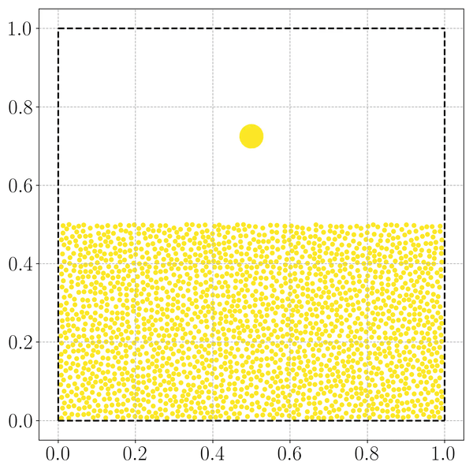

# granulargas
Event driven simulations of a two dimensional gas of colliding discs. First exercise in TFY4235 - Computational physics.

To run scipts in parallel, use

`for i in {1..8}; do python problem_1.py $i &done;`

